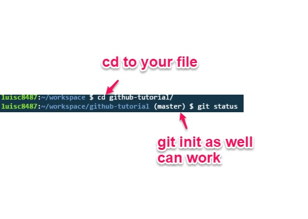

# GitHub Tutorial

_by Luis Cordero_

---
## Git vs. GitHub
The difference between Git and Github 
  
Git is basically taking a snapshots of 
code and it doesn't require GitHub. 
But Github requires Git. Github uses 
the [cloud](https://www.thecloud.net/),
an online server to store your work. 

---
## Initial Setup
Go to [github.com](https://github.com/) sign up. Make sure you sign for **free account**.
After doing three step setup, you have just made a github account.  

Keep in mind to remember your **password** and **username** for your github account. 

SSH keys are a way to identify trusted computers without involving passwords. 

---
## Repository Setup
How to create your first repo, only take a few steps. 
 
 First create a new repo on your github account,
 as seen on the images below. After giving the repo a name, 
 keep in mind the folder name of that repo has to be same (_case sensitive_)
 within your workspace of that specific folder you'll be working on. 
 
 

So now since we're in our workspace within [c9.io](https://c9.io/).
Lets create a file called README.md witht the use of `touch` command.
But before you create file `cd` into your file. By thew time you cd into your file
master branch must appear within bash. This tells the user that the file is a repository
or another way you7 could have create a repository would be `git init`.

After create the file, open the file and edit it. 
Since you modified your file up the file on the staging area, 
in other words `git add [file]`. Git add, adds file to the staging area.

Now `git commit -m ` in order to tap a snapshot of an changes to the file/folder.
Last git push use the existing repository from the command line or the image above.

`cd` - change directory

`touch` - create file(s)

`git init`- create a repo

---
## Workflow & Commands

`git add [file]` - adds file(s) to staging area 
to make sure modified files are read already just like this image below 

`git push` - to push updated files to remote

`git comnit -m `- to take a snapshot with a meassge attach based 
on the modified file you "saved"/ snapped 

`git status`- bascially asking the computer for changes you've made.

Changes will be in red that arent on staging area, but in green are modified files that are on stage.

If you use all thse commands constantly, your pratically can ask what types of changes you've done.
Then add all changes, save them. Next your able to push them on to you repository. All in all you can constantly 
keep updating you remote online and local workspace, just dont forget to **git add, push, commit**. Last tip always 
use **git status**. 